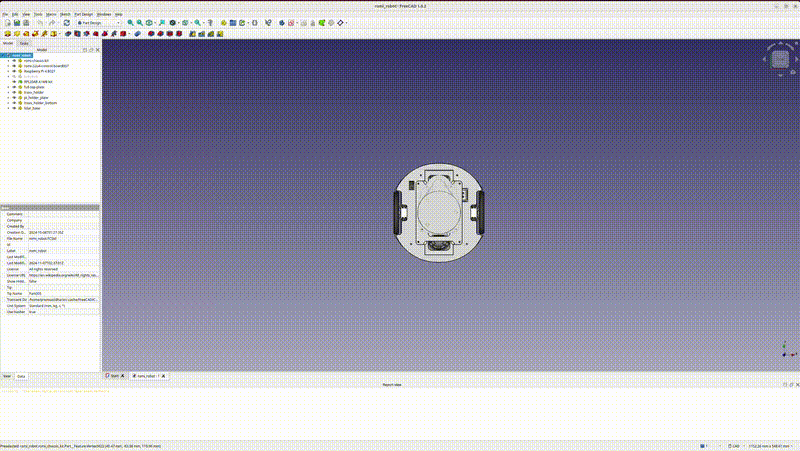

# CAD Files

CAD models and designs for the Pololu Romi robot.

## Files

- `romi_robot.FCStd` - FreeCAD model of the Romi robot

## Components

The CAD model includes STEP files of:
- Pololu Romi robot
- Raspberry Pi
- A1M28 Lidar

## Software

This CAD model was created using [FreeCAD](https://www.freecad.org/), an open-source parametric 3D CAD modeler.
