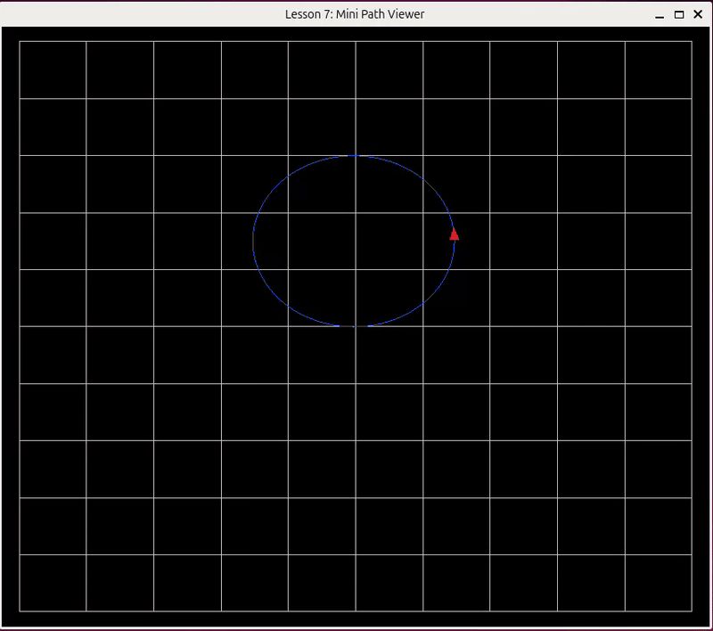
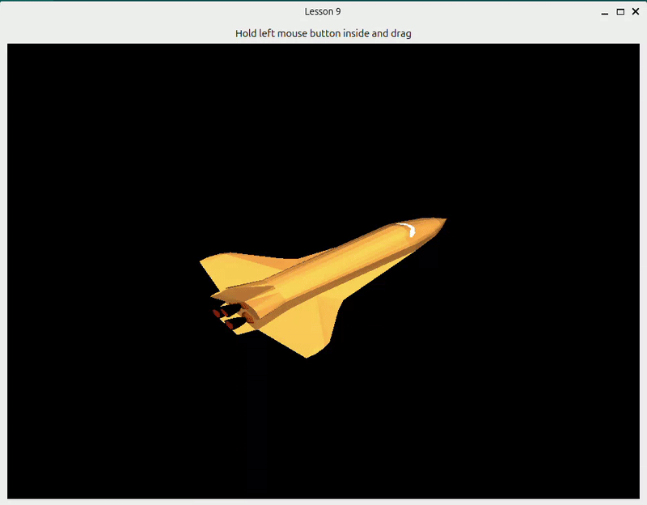

# OpenGL Tutorial (Python / helper_py)

Hands-on lessons that mirror the C++ track in [`qt_cpp/opengl_tutorial/`](../../qt_cpp/opengl_tutorial/). Same concepts and lesson order; concepts and exercises are documented there (`lesson.md`, `intro_opengl.md`).

## Prerequisites

```bash
cd python_simulations
pip install -r opengl_tutorial/requirements.txt
```

Read first (C++ docs apply to both tracks):

1. [qt_cpp/opengl_tutorial/intro_opengl.md](../../qt_cpp/opengl_tutorial/intro_opengl.md)
2. [00_prerequisites.md](00_prerequisites.md)

## Run a lesson

From `python_simulations/`:

```bash
python opengl_tutorial/01_hello_triangle/main.py
python opengl_tutorial/08_rotating_triangle_3d/main.py
```

Or from a lesson folder:

```bash
cd python_simulations/opengl_tutorial/01_hello_triangle
python main.py
```

## Lessons

| # | Folder | Topic | C++ concepts |
|---|--------|--------|----------------|
| 1 | [01_hello_triangle](01_hello_triangle/) | First triangle, `Program.Use` | [lesson.md](../../qt_cpp/opengl_tutorial/01_hello_triangle/lesson.md) |
| 2 | [02_vertex_colors](02_vertex_colors/) | Two vertex attributes, `varying` | [lesson.md](../../qt_cpp/opengl_tutorial/02_vertex_colors/lesson.md) |
| 3 | [03_uniform_transform](03_uniform_transform/) | `uniform mat3`, +/- scale | [lesson.md](../../qt_cpp/opengl_tutorial/03_uniform_transform/lesson.md) |
| 4 | [04_indexed_quad](04_indexed_quad/) | `ElementArrayBuffer`, `glDrawElements` | [lesson.md](../../qt_cpp/opengl_tutorial/04_indexed_quad/lesson.md) |
| 5 | [05_texture_quad](05_texture_quad/) | `Texture2D`, A/D rotate, R reset | [lesson.md](../../qt_cpp/opengl_tutorial/05_texture_quad/lesson.md) |
| 6 | [06_dynamic_line_strip](06_dynamic_line_strip/) | `GL_DYNAMIC_DRAW`, spiral timer | [lesson.md](../../qt_cpp/opengl_tutorial/06_dynamic_line_strip/lesson.md) |
| 7 | [07_mini_path_viewer](07_mini_path_viewer/) | Grid + trail + `mat3` marker | [lesson.md](../../qt_cpp/opengl_tutorial/07_mini_path_viewer/lesson.md) |
| 8 | [08_rotating_triangle_3d](08_rotating_triangle_3d/) | MVP, pyramid, per-vertex colors, roll/pitch/yaw | [lesson.md](../../qt_cpp/opengl_tutorial/08_rotating_triangle_3d/lesson.md) |

Each folder has `main.py` (runnable) and `lesson.md` (Python-specific run notes).

## Reference

- Library API: [`helper_py/README`](../helper_py/) — use `example_triangles.py` for a minimal `helper_py` sample
- C++ library: [`helper_opengl/README.md`](../../qt_cpp/helper_opengl/README.md)

<p align="center">
  
  
</p>
