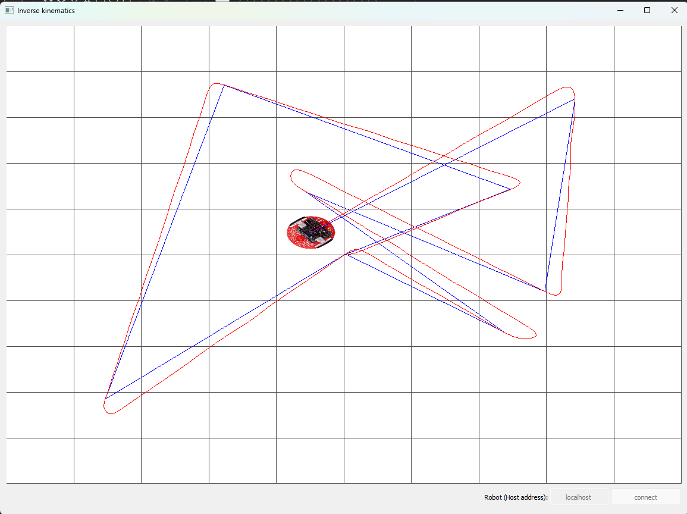

# Inverse Kinematics App (I2C Version)

Server application that bridges I2C communication with a Pololu Romi 32U4 robot and provides network access for remote monitoring and control via the viewer application.


*Inverse Kinematics Viewer - GUI application for monitoring robot navigation and sending waypoints*

## Overview

This Qt-based server application runs on a **Raspberry Pi that is physically attached to the Romi robot controller** via I2C. It enables:
- **I2C Communication**: Direct communication with Romi robot over I2C bus (Raspberry Pi as master)
- **Network Bridge**: TCP/IP server that bridges I2C communication with network clients
- **Remote Control**: Allows viewer applications (running on **any PC**) to control and monitor the robot from any network-connected device
- **Threaded Architecture**: Separate threads for I2C communication and network handling

**Deployment Model:**
- **Server (`inverse_kinematics_app_i2c`)**: Runs on Raspberry Pi connected to Romi robot via I2C
- **Viewer (`inverse_kinematics_viewer`)**: Runs on any PC (Windows, Linux, macOS) connected to the same network

## Architecture

```
┌─────────────────┐         TCP/IP          ┌──────────────────────┐
│  Viewer App     │ ←──────────────────────→ │  inverse_kinematics  │
│  (Any PC)       │    Port 60000            │     _app_i2c         │
│  Windows/Linux/ │                          │  (Raspberry Pi)      │
│  macOS          │                          └──────────────────────┘
└─────────────────┘                                  │
                                                      │ I2C (Physical)
                                                      │ (Address 20)
                                                      │ SDA, SCL, GND
                                                      ↓
                                              ┌───────────────┐
                                              │  Romi Robot   │
                                              │  Controller   │
                                              │  (Arduino)   │
                                              └───────────────┘
```

**Physical Setup:**
- Raspberry Pi is **physically attached** to the Romi robot controller via I2C wires (SDA, SCL, GND)
- Viewer application runs on **any PC** on the same network (can be different computer, different OS)

### Components

1. **RomiRobotServer**: Main server class that handles TCP/IP connections
2. **MotionControlThread**: Background thread that manages I2C communication with the robot
3. **I2cSlave**: Low-level I2C communication class implementing PololuRPiSlave protocol
4. **Command/Response Structures**: Binary data structures matching Arduino side

## Hardware Requirements

### Server Side (Raspberry Pi)
- **Raspberry Pi** (as I2C master and network server)
- **Pololu Romi 32U4 Robot Controller** physically attached via I2C
- **I2C Connection**: SDA, SCL, and GND wires properly connected between Raspberry Pi and Romi controller
- **Network**: Ethernet or WiFi for TCP/IP communication

### Client Side (Viewer)
- **Any PC** (Windows, Linux, or macOS)
- **Network**: Ethernet or WiFi connection to same network as Raspberry Pi
- **No special hardware required** - viewer runs on standard desktop/laptop

## Software Requirements

- **Qt5** (Network, Core components)
- **Eigen3** (for vector math)
- **Linux I2C support** (`/dev/i2c-1` device)
- **CMake** 3.8.2 or later

## Building

### Prerequisites

**Note**: Build this application on the **Raspberry Pi** (the server that will be attached to the robot).

Install required dependencies on Raspberry Pi:

```bash
# Qt5 and development tools
sudo apt-get update
sudo apt-get install qt5-default qtbase5-dev qtbase5-dev-tools

# Eigen3
sudo apt-get install libeigen3-dev

# I2C tools (for testing)
sudo apt-get install i2c-tools

# CMake
sudo apt-get install cmake
```

### Build Steps

1. **Navigate to project directory**:
   ```bash
   cd qt_cpp/inverse_kinematics_app_i2c
   ```

2. **Create build directory**:
   ```bash
   mkdir build
   cd build
   ```

3. **Configure and build**:
   ```bash
   cmake ..
   make
   ```

4. **Executable location**:
   - Binary: `build/inverse_kinematics_app_i2c`

## Configuration

### I2C Device Path

Default I2C device: `/dev/i2c-1` (configured in `motion_control_thread.cpp` line 74)

To change the I2C device:
```cpp
// In motion_control_thread.cpp, line 74
RomiRobot romi(QString("/dev/i2c-1"), 20);  // Change device path here
```

### I2C Slave Address

Default slave address: **20** (0x14 hexadecimal)

To change the I2C address:
```cpp
// In motion_control_thread.cpp, line 74
RomiRobot romi(QString("/dev/i2c-1"), 20);  // Change address here
```

**Note**: The Arduino sketch must use the same I2C address (configured in `slave.init(20)`).

### Network Configuration

Default settings (in `main.cpp`):
- **IP Address**: `localhost` (0.0.0.0 - listens on all interfaces)
- **Port**: `60000`

To change network settings:
```cpp
// In main.cpp, line 7
RomiRobotServer robot_server(QString("localhost"), 60000);
// Change to specific IP: QString("192.168.1.100")
// Change port: 60000 → <desired_port>
```

## Usage

### Basic Operation

1. **Enable I2C on Raspberry Pi**:
   ```bash
   sudo raspi-config
   # Navigate to: Interface Options → I2C → Enable
   ```

2. **Verify I2C connection**:
   ```bash
   # Check I2C device exists
   ls /dev/i2c-*
   # Should show: /dev/i2c-1

   # Scan for I2C devices
   sudo i2cdetect -y 1
   # Should show device at address 0x14 (20 decimal)
   ```

3. **Run the server**:
   ```bash
   ./inverse_kinematics_app_i2c
   ```

   Expected output:
   ```
   I2C device opened: /dev/i2c-1 at address 20
   I2C communication initialized
   Port: 60000
   ```

4. **Connect viewer application** (on any PC):
   - Launch `inverse_kinematics_viewer` on **any PC** (Windows, Linux, or macOS)
   - Ensure the PC is on the same network as the Raspberry Pi
   - Enter Raspberry Pi's IP address in the viewer
   - Click **Connect**
   - Click on the view to add waypoints
   
   **Note**: The viewer application can run on a completely different computer than the Raspberry Pi. It only needs network connectivity to the Raspberry Pi.

### Network Communication Protocol

The server uses a simple ASCII-based protocol over TCP/IP:

**Waypoint Command** (Viewer → Server):
```
w: <x>, <y>
```
- **x, y**: Coordinates in meters (floating point)
- **Example**: `w: 0.5, 0.3`

**Status Response** (Server → Viewer):
```
s: <x>, <y>, <yaw>
```
- **x, y**: Position in meters
- **yaw**: Heading angle in radians
- **Example**: `s: 0.45, 0.28, 1.57`

### I2C Communication Protocol

The server communicates with Arduino using binary structured data via PololuRPiSlave protocol:

- **Command ID Tracking**: Each command includes a unique `cmd_id` to prevent duplicate processing
- **Binary Format**: All values transmitted as integers (multiplied by 1000)
- **Commands**: `'w'` (waypoint), `'s'` (status), `'r'` (reset)
- **Retry Logic**: Automatic retry on transient I2C errors (EIO, EAGAIN, ETIMEDOUT)

See `arduino/inverse_kinematics_i2c/README.md` for detailed I2C protocol documentation.

## File Structure

```
inverse_kinematics_app_i2c/
├── main.cpp                    # Application entry point
├── romi_robot_server.h/cpp      # TCP/IP server and network handling
├── motion_control_thread.h/cpp # I2C communication thread
├── i2c_slave.h/cpp             # Low-level I2C operations
├── cmd_response.h              # I2C command/response data structures
└── CMakeLists.txt              # Build configuration
```

## Architecture Details

### Threading Model

1. **Main Thread**: Handles TCP/IP server, accepts connections, manages waypoint queue
2. **MotionControlThread**: Background thread that:
   - Polls robot status via I2C (every 100ms)
   - Sends waypoints to robot when queue is not full
   - Updates position cache for network clients

### I2C Communication

- **Protocol**: PololuRPiSlave (index-based I2C)
- **Write Operations**: Limited to 16 bytes per transaction
- **Timing**: 100μs delay after writes to allow AVR TWI module to process
- **Error Handling**: Retry logic with exponential backoff for transient errors

### Waypoint Queue Management

- **Server Queue**: Stores waypoints from network clients
- **Robot Queue**: Arduino maintains its own queue (max 4 waypoints)
- **Flow Control**: Server checks `is_queue_full` before sending new waypoints
- **Retry Logic**: Failed waypoint sends are retried on next poll cycle

## Performance

- **I2C Poll Rate**: 10 Hz (100ms interval)
- **Network Update Rate**: 40 Hz (25ms interval)
- **TCP/IP Port**: 60000
- **Max Concurrent Connections**: 1 (configurable in `romi_robot_server.cpp`)

## Related Projects

This application pairs with:

- **inverse_kinematics_viewer**: GUI application for monitoring and sending waypoints (runs on any PC)
- **arduino/inverse_kinematics_i2c**: Arduino sketch running on the Romi robot controller

**Deployment Summary:**
- **Raspberry Pi**: Runs `inverse_kinematics_app_i2c` (server), physically connected to Romi robot via I2C
- **Any PC**: Runs `inverse_kinematics_viewer` (client), connects to Raspberry Pi over network
- **Romi Robot**: Runs Arduino sketch, communicates with Raspberry Pi via I2C

## Comparison with Serial Version

This I2C version differs from `inverse_kinematics_app` (serial version):

| Feature | I2C Version | Serial Version |
|---------|-------------|----------------|
| Communication | I2C bus | USB Serial |
| Protocol | Binary (PololuRPiSlave) | ASCII text |
| Server Host | Raspberry Pi only | Any Linux/Windows |
| Viewer Host | Any PC (Windows/Linux/macOS) | Any PC (Windows/Linux/macOS) |
| Latency | Lower | Higher |
| Reliability | More reliable | USB dependent |
| Setup | Requires I2C wiring | USB cable only |
| Physical Connection | Raspberry Pi attached to robot | PC connected via USB |

## Contributing

This is a demonstration project. Feel free to modify for your specific robot configuration and requirements.

