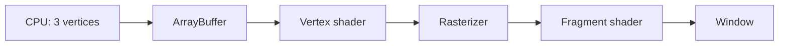

# Lesson 1: Hello Triangle

## What you will learn

- The `QOpenGLWidget` lifecycle (`initializeGL`, `resizeGL`, `paintGL`)
- What a vertex buffer (`ArrayBuffer`) stores
- How vertex and fragment shaders work at a basic level
- How `Program::Use` activates a shader for drawing

## Big picture



## Walkthrough

1. **Vertices** — Three `Vector2f` points in NDC form a triangle.
2. **`ArrayBuffer`** — Copies vertices to GPU memory with `GL_STATIC_DRAW` (data rarely changes).
3. **`Program`** — Compiles `kVertexShader` and `kFragmentShader`, links them.
4. **`paintGL`** — Clears to black, binds `coord` attribute from the VBO, sets `color` uniform to red, calls `glDrawArrays(GL_TRIANGLES, 0, 3)`.

## Build and run

```bash
cd qt_cpp/build
cmake --build . --target opengl_lesson_01
./opengl_tutorial/01_hello_triangle/opengl_lesson_01
```

## Expected result

A red triangle centered on a black window.

## What helper_opengl hid

- `ArrayBuffer` constructor: `glGenBuffers`, `glBindBuffer`, `glBufferData`
- `Program` constructor: `glCreateShader`, `glCompileShader`, `glAttachShader`, `glLinkProgram`
- `setAttribute` / `setUniform`: `glGetAttribLocation`, `glVertexAttribPointer`, `glUniform*`

## Exercises

1. Change vertex positions so the triangle is smaller and in the top-right corner.
2. Set `color` to green `(0, 1, 0)`.
3. Add a second triangle by appending three more vertices to the vector (six vertices total); draw with one `glDrawArrays` call (two triangles).

## Next lesson

[Lesson 2: Vertex colors](../02_vertex_colors/lesson.md)
