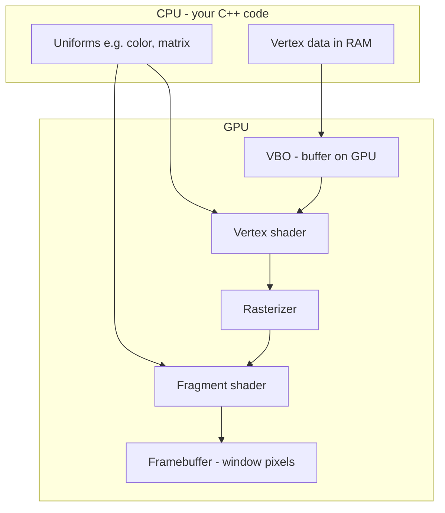

# Introduction to OpenGL (for beginners)

This document explains **what OpenGL is and how it thinks**, before you write code. It is conceptual reading—no programming required yet.

After this intro, continue with [00_prerequisites.md](00_prerequisites.md) (install and build), then [Lesson 1](01_hello_triangle/lesson.md).

---

## Who this is for

You are learning to draw 2D and 3D graphics with Qt and the [`helper_opengl`](../helper_opengl/) library. You do **not** need prior OpenGL, graphics, or GPU experience. Basic C++ and “programs run on CPU” is enough.

---

## What problem does OpenGL solve?

Your computer has two useful processors for graphics:

| Processor | Good at | Typical role in apps |
|-----------|---------|----------------------|
| **CPU** | Logic, file I/O, UI events, application logic | Qt widgets, data processing, networking |
| **GPU** | Many parallel, simple math operations | Drawing thousands of triangles per frame |

Drawing an animated line chart or map overlay every frame by setting pixels on the CPU would be too slow. OpenGL lets the **GPU** draw triangles and images quickly while the CPU prepares small batches of data.

---

## What is OpenGL?

**OpenGL** is a **specification**: a documented set of functions and rules that a graphics driver implements on your machine. It is not a single app you download; your GPU vendor + operating system provide the actual implementation.

In this tutorial you use OpenGL through:

1. **Qt** — creates a window and an **OpenGL context** (connection to the GPU).
2. **OpenGL commands** — e.g. clear screen, draw triangles (`glDrawArrays`, …).
3. **`helper_opengl`** — C++ helpers that manage buffers, shaders, and textures safely (see [Why helper_opengl was created](#why-helper_opengl-was-created)).

You will mostly touch (2) via (3); understanding (1), the pipeline below, and why the wrapper library exists still matters when something goes wrong (black screen, wrong size, etc.).

---

## The rendering pipeline (core idea)

3D (and 2D) rendering is a **pipeline**: data flows through fixed stages. You customize two stages with **shaders** (small programs that run on the GPU).



| Stage | What happens (plain language) |
|-------|-------------------------------|
| **Vertex data** | Points, lines, triangles you want to draw (positions, colors, texture coords). |
| **Buffer upload** | Copy data from CPU memory to GPU memory (a **VBO**). |
| **Vertex shader** | Runs **once per vertex**. Computes where that vertex appears on screen. |
| **Rasterizer** | Turns triangles into **fragments** (candidate pixels). |
| **Fragment shader** | Runs **once per fragment**. Decides the final color (and can sample textures). |
| **Framebuffer** | The image shown in the window (after depth/test/blending if enabled). |

**Important:** You do not draw pixels directly in C++. You describe geometry and shaders; the GPU runs the pipeline.

---

## Vocabulary you will see everywhere

| Term | Meaning |
|------|---------|
| **Vertex** | One point in your mesh (e.g. corner of a triangle), often with extra data (color, UV). |
| **Fragment** | A pixel-sized sample produced inside a triangle (before final color is written). |
| **Primitive** | What you draw: `GL_TRIANGLES`, `GL_LINES`, `GL_LINE_STRIP`, etc. |
| **Shader** | GPU program; in these lessons mainly **vertex** + **fragment** shaders. |
| **GLSL** | OpenGL Shading Language; C-like code for shaders (`#version 120` in this course). |
| **Attribute** | Per-vertex input to the vertex shader (`coord`, `vert_color`, …). |
| **Uniform** | Constant for one draw call (same for all vertices/fragments): `color`, `mat`, texture unit index. |
| **VBO** | Vertex Buffer Object; GPU memory holding vertex (or index) arrays. `ArrayBuffer` in `helper_opengl`. |
| **EBO / index buffer** | List of vertex indices for reusing corners (`ElementArrayBuffer`). |
| **Texture** | Image on the GPU sampled by UV coordinates in the fragment shader. |
| **Draw call** | `glDrawArrays` or `glDrawElements` — “execute this pipeline with current state.” |
| **OpenGL context** | GPU connection tied to a window; all GL calls need an active context (Qt’s `QOpenGLWidget` provides this). |
| **NDC** | Normalized Device Coordinates: in lessons 1–7, x and y are often placed directly in **-1…1**; lesson 8 reaches NDC via model × view × projection. |

---

## Coordinate systems (simplified for this tutorial)

Full 3D graphics uses several spaces (model → world → view → clip).

**Lessons 1–7 (2D)** — Vertex positions are mostly 2D points sent straight to clip space (z = 0):

- **(-1, -1)** ≈ bottom-left of the widget  
- **(1, 1)** ≈ top-right  
- **(0, 0)** ≈ center  

Lesson 3 adds a **`mat3` uniform** to scale or pan that 2D geometry.

**Lesson 8 (3D)** — Uses `vec3` vertices and **model × view × projection** (`mat4` MVP); see [3D rotation example](#3d-rotation-example-roll-pitch-yaw-with-eigen3) below.

---

## Shaders: what you actually write

Shaders are text files (embedded as strings in C++) compiled at runtime.

| Shader | Runs on | Typical job in our lessons |
|--------|---------|----------------------------|
| **Vertex** | Each vertex | `gl_Position = …` (where on screen) |
| **Fragment** | Each fragment | `gl_FragColor = …` or texture lookup |

Example roles:

- Vertex shader passes **color** to the fragment shader via a **`varying`** (interpolated across the triangle).
- Fragment shader can use a **`uniform vec3 color`** (one color for the whole triangle) or a **texture**.

We use **GLSL 1.20** syntax (`attribute`, `varying`, `texture2D`) for broad GPU compatibility. Newer tutorials online often show `#version 330 core`; the ideas are the same, only keywords differ.

---

## OpenGL as a state machine

OpenGL remembers **current state**: which program is active, which buffers are bound, viewport size, clear color, etc. Your frame loop usually:

1. **Clear** the color buffer (`glClear`).
2. **Activate** a shader program (`Program::use` / `Program::Use`).
3. **Point** attributes at buffers (`setAttribute`).
4. **Set** uniforms (`setUniform`).
5. **Draw** (`glDrawArrays` / `glDrawElements`).

Forgetting a step—especially viewport after resize, or drawing before `initializeGL`—is a common reason for a **blank window**.

---

## Modern OpenGL vs. old “fixed function”

Older OpenGL let you call `glBegin` / `glEnd` and fixed lighting. That path is **deprecated**.

**Modern style** (what you learn here):

- You supply your own shaders.
- You store geometry in **buffer objects**.
- You explicitly set uniforms and attributes.

`helper_opengl` is built for this modern, programmable pipeline.

---

## Where Qt fits

Qt handles the boring platform work:

- Window and event loop (`QApplication`).
- OpenGL surface inside a widget (`QOpenGLWidget`).
- Lifecycle hooks: `initializeGL`, `resizeGL`, `paintGL`.

Details and install steps are in [00_prerequisites.md](00_prerequisites.md)—this intro does not repeat them.

---

## Why helper_opengl was created

This tutorial teaches OpenGL through a small C++ library in [`helper_opengl`](../helper_opengl/), not through hundreds of raw `gl*` calls in every lesson. The library exists for practical reasons:

### The problem: same work, many times

Modern OpenGL is flexible but low-level. For each drawable you often write boilerplate by hand:

- Buffer objects: `glGenBuffers`, `glBufferData`, `glBindBuffer`, `glDeleteBuffers`
- Shaders: create, compile, attach, link, check errors, delete shader objects
- Attributes: `glGetAttribLocation`, `glEnableVertexAttribArray`, `glVertexAttribPointer`
- Uniforms: `glGetUniformLocation`, then the correct `glUniform*` for each type
- Textures: `glGenTextures`, parameters, `glTexImage2D`, bind to a texture unit

That code is repetitive, easy to get wrong (leaks, wrong bind order, mismatched attribute names), and painful to copy between two Qt widgets that both draw grids, polylines, and textured quads.

### What the library is (and is not)

`helper_opengl` is a **thin, project-specific utility layer**—not a game engine or a full graphics framework.

| It provides | It does **not** provide |
|-------------|-------------------------|
| `ArrayBuffer` / `ElementArrayBuffer` (RAII vertex and index buffers) | Scene graphs, 3D asset loaders, physics |
| `Program` and `Program::Use` (shaders, uniforms, attributes) | Windows or GL contexts (Qt does that) |
| `Texture2D` (2D images on the GPU) | High-level UI or charting widgets |

You still issue **`glClear`**, **`glDrawArrays`**, and **`glDrawElements`** yourself so the rendering pipeline stays visible while you learn.

### Design choices

1. **RAII and Qt object parents** — GPU objects must be destroyed when the OpenGL context goes away. Buffers and programs can use a `QOpenGLWidget` as `QObject` parent so cleanup matches widget lifetime.

2. **Eigen integration** — `Vector2f` / `Matrix3f` for 2D lessons; `Vector3f` / `Matrix4f` for 3D (lesson 8). The library’s `setAttribute` and `setUniform` overloads accept those types instead of manual pointer/size setup every frame.

3. **Qt’s OpenGL entry point** — Classes use `QOpenGLFunctions` so function pointers are resolved the same way across platforms.

4. **One shared static library** — Built once as `libhelper_opengl.a` and linked by the tutorial lessons and other Qt apps in this repo, so shader and buffer logic is implemented in one place.

5. **Python counterpart** — [`helper_py`](../../python_simulations/helper_py/) mirrors the same ideas for PySide6 and PyOpenGL if you prefer Python.

### Typical use in application code

After setup in `initializeGL()`, a frame often looks like this: activate a program, bind attributes from buffers, set uniforms, draw.

```cpp
Program::Use use(*program_, {"coord"});
program_->setAttribute("coord", *line_buffer_);
program_->setUniform("mat", mat);
program_->setUniform("color", r, g, b);
glDrawArrays(GL_LINE_STRIP, 0, static_cast<GLsizei>(line_buffer_->size()));
```

The tutorials use this same pattern so what you learn maps directly to real widgets that link against `helper_opengl`.

### What each wrapper replaces

| Wrapper | Replaces manual |
|---------|------------------|
| `ArrayBuffer` / `ElementArrayBuffer` | `glGenBuffers`, `glBufferData`, cleanup |
| `Program` | Compile/link shaders, `glGetUniformLocation`, … |
| `Program::Use` | Activate program and enable attribute arrays in a scope |
| `Texture2D` | `glGenTextures`, parameters, `glTexImage2D` |

More detail: [helper_opengl/README.md](../helper_opengl/README.md) (API and design philosophy).

---

## What the lessons teach (roadmap)

| Lesson | OpenGL idea |
|--------|-------------|
| 1 | First draw: VBO + shaders + `glDrawArrays` |
| 2 | Multiple attributes + interpolated color |
| 3 | Uniform matrix (zoom/pan pattern) |
| 4 | Index buffer + `glDrawElements` |
| 5 | Textures and UV coordinates |
| 6 | Dynamic buffers (paths that grow each frame) |
| 7 | Grid + trajectory (mini path viewer capstone) |
| 8 | 3D triangle, `mat4` MVP, roll/pitch/yaw with Eigen3 |

Lessons 1–7 stay in **2D** NDC. Lesson 8 adds depth and perspective. After lesson 8, combine 2D techniques (textures, `mat3`, dynamic buffers) with 3D MVP in your own Qt widgets.

---

## 3D rotation example (roll, pitch, yaw with Eigen3)

Lesson 8 ([`08_rotating_triangle_3d`](08_rotating_triangle_3d/)) rotates a triangle in 3D using Eigen—not the `mat3` from lesson 3, but a full **model–view–projection** chain with `Eigen::Matrix4f`.

### Pipeline change from 2D

| 2D lessons | Lesson 8 |
|------------|----------|
| `vec2` positions, `mat3` | `vec3` positions, `mat4 mvp` |
| No depth buffer | `glEnable(GL_DEPTH_TEST)`, depth buffer on the surface format |
| Coordinates often in NDC directly | Model rotates geometry; view + projection map to clip space |

### Euler angles → rotation matrix

**Roll** rotates around X, **pitch** around Y, **yaw** around Z. This lesson composes them as:

**R = Rz(yaw) × Ry(pitch) × Rx(roll)**

```cpp
// Explicit (lesson default): Rx, Ry, Rz with std::cos / std::sin — see main.cpp
const Eigen::Matrix3f R = rotationZ(yaw) * rotationY(pitch) * rotationX(roll);

// Easy (Eigen): uncomment in main.cpp, #include <Eigen/Geometry>
// const Eigen::AngleAxisf roll_ax(roll, Eigen::Vector3f::UnitX());
// const Eigen::AngleAxisf pitch_ax(pitch, Eigen::Vector3f::UnitY());
// const Eigen::AngleAxisf yaw_ax(yaw, Eigen::Vector3f::UnitZ());
// const Eigen::Matrix3f R = (yaw_ax * pitch_ax * roll_ax).matrix();

Eigen::Matrix4f model = Eigen::Matrix4f::Identity();
model.block<3, 3>(0, 0) = R;
```

Angles are in **radians**. Keyboard updates `roll`, `pitch`, and `yaw`; each key press calls `update()` to redraw.

### View, projection, and MVP

```cpp
Eigen::Matrix4f view = Eigen::Matrix4f::Identity();
view(2, 3) = -2.8f;  // move the scene back along Z (camera looks down -Z)

Eigen::Matrix4f projection = perspective(45.0f, aspect, 0.1f, 10.0f);

const Eigen::Matrix4f mvp = projection * view * model;
program->setUniform("mvp", mvp);
```

The vertex shader multiplies each `vec3` vertex by `mvp`:

```glsl
attribute vec3 coord;
uniform mat4 mvp;
void main(void) {
  gl_Position = mvp * vec4(coord, 1.0);
}
```

Eigen stores matrices in **column-major** order, which matches OpenGL’s `glUniformMatrix4fv`—`helper_opengl` passes `Matrix4f` without an extra transpose by default.

### Run the example

```bash
cd qt_cpp/build
cmake --build . --target opengl_lesson_08
./opengl_tutorial/08_rotating_triangle_3d/opengl_lesson_08
```

Controls: **Q/E** roll, **W/S** pitch, **A/D** yaw, **R** reset. Full detail: [08_rotating_triangle_3d/lesson.md](08_rotating_triangle_3d/lesson.md).

---

## Common beginner mistakes

| Symptom | Things to check |
|---------|------------------|
| Blank / black window | Did `initializeGL` create buffers? Any shader compile error? Is `paintGL` called? |
| Tiny or clipped drawing | Viewport set in `resizeGL`? Coordinates in -1…1 range? |
| Wrong colors | Attribute names match shader (`coord` vs `position`)? Two buffers same length? |
| Nothing updates | Call `update()` after changing data (e.g. keyboard/timer). |
| Crash on startup | OpenGL context not ready; create GL objects only in `initializeGL`, not in the widget constructor. |

---

## What this intro deliberately skips

You do not need these for the early lessons (lesson 8 introduces basic 3D depth and perspective only):

- Full 3D cameras, scene graphs, and mesh loading  
- Lighting models (Phong, PBR)  
- Framebuffer objects (off-screen rendering)  
- Vulkan / Metal / DirectX (different APIs, similar pipeline ideas)  

---

## Suggested reading order

1. **This file** — concepts and vocabulary  
2. [00_prerequisites.md](00_prerequisites.md) — install, build, Qt GL lifecycle  
3. [01_hello_triangle/lesson.md](01_hello_triangle/lesson.md) — first running program  
4. [helper_opengl/README.md](../helper_opengl/README.md) — API reference when coding  

Official references (optional): [Khronos OpenGL Wiki](https://www.khronos.org/opengl/wiki/), [Qt OpenGL module](https://doc.qt.io/qt-5/qtopengl-index.html).

---

## Summary in one paragraph

OpenGL is a GPU drawing API: you upload vertices and indices to buffers, write vertex and fragment shaders in GLSL, set a few uniforms, and issue draw calls each frame. Qt gives you a window and context; `helper_opengl` was created to share safe buffer, shader, and texture setup across Qt apps so you focus on *what* to draw, not repeated low-level GL boilerplate. The tutorials build from a 2D triangle through paths on a grid (lessons 1–7), then a 3D triangle with roll, pitch, and yaw via Eigen3 (lesson 8).

**Next step:** [00_prerequisites.md](00_prerequisites.md)
