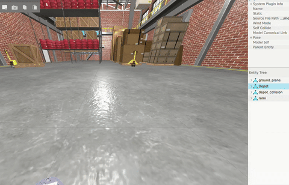

# Romi Gazebo Encoder Plugin

Gazebo Ignition plugin that models Romi robot wheel encoders using the `WheelWithEncoder` class for accurate DC motor dynamics simulation.

## Overview

This plugin implements a **hybrid approach** for wheel encoder modeling:
- **cmd_vel** sets target velocities in `WheelWithEncoder`
- **Actual joint velocities** from physics provide feedback
- **WheelWithEncoder** models motor dynamics and encoder response
- **Odometry** is published based on encoder readings



## Features

- ✅ Realistic motor dynamics with PID control
- ✅ Encoder noise modeling
- ✅ Physics-based feedback (actual joint velocities)
- ✅ Odometry publishing
- ✅ cmd_vel topic support

## Building the Plugin

### Prerequisites

- **ros2_docker**: The ROS2 Docker environment is required for using this plugin. See `ros2_docker/` directory for setup instructions.
- Gazebo Fortress (Ignition Gazebo 6)
- CMake 3.10+
- C++17 compiler
- Ignition Gazebo development packages

### Build Steps

```bash
cd romi_gazebo
mkdir build
cd build
cmake ..
make
```

The plugin will be built as `libromi_encoder_plugin.so` in the build directory.

## Configuration

The plugin is configured in the SDF file (`romi_world.sdf`):

```xml
<plugin
  filename="libromi_encoder_plugin.so"
  name="romi::gazebo::RomiEncoderPlugin">
  <wheel_radius>0.035</wheel_radius>
  <wheel_base>0.14</wheel_base>
  <encoder_ticks_per_rotation>1440</encoder_ticks_per_rotation>
  <control_dt>0.025</control_dt>
  <pid_kp>0.1613</pid_kp>
  <pid_ki>12.9032</pid_ki>
  <pid_kd>0.0</pid_kd>
  <cmd_vel_topic>/model/romi/cmd_vel</cmd_vel_topic>
  <odometry_topic>/model/romi/odometry</odometry_topic>
</plugin>
```

### Parameters

- `wheel_radius`: Wheel radius in meters (default: 0.035)
- `wheel_base`: Distance between wheels in meters (default: 0.14)
- `encoder_ticks_per_rotation`: Encoder resolution (default: 1440)
- `control_dt`: Control loop period in seconds (default: 0.025 = 25ms)
- `pid_kp`, `pid_ki`, `pid_kd`: PID controller gains (default: 0.1613, 12.9032, 0.0)
- `cmd_vel_topic`: Topic for velocity commands (default: `/model/romi/cmd_vel`)
- `odometry_topic`: Topic for odometry output (default: `/model/romi/odometry`)

## Usage

**Note**: This plugin requires the `ros2_docker` environment. Make sure you have the Docker container set up and running before proceeding. See `ros2_docker/` directory for setup instructions.

This section provides step-by-step instructions for building, configuring, and using the Romi encoder plugin.

### Step 1: Build the Plugin

#### Inside Docker Container

All commands should be run inside the `ros2_docker` container:

```bash
cd /ros2_ws/exploration/romi_robot_demos/romi_gazebo
mkdir -p build
cd build
cmake ..
make
```

The plugin will be built as `libromi_encoder_plugin.so` in the `build` directory.

#### Set Plugin Path

Make sure the plugin path is in `GZ_SIM_SYSTEM_PLUGIN_PATH`:
```bash
export GZ_SIM_SYSTEM_PLUGIN_PATH=$PWD/build:$GZ_SIM_SYSTEM_PLUGIN_PATH
```

This allows Gazebo to find the plugin in the build directory without installing it system-wide.

### Step 2: Launch Gazebo

Launch Gazebo with the Romi robot using the ROS2 launch file:

```bash
cd /ros2_ws/exploration/romi_robot_demos/romi_gazebo
ros2 launch romi_control.launch.py
```

This will:
- Launch Gazebo with the Romi robot
- Start the `ros_gz_bridge` to bridge topics between Gazebo and ROS2
- Enable ROS2 control of the robot

### Step 3: Control the Robot

Use ROS2 topics to control the robot:

```bash
# Move forward
ros2 topic pub /model/romi/cmd_vel geometry_msgs/msg/Twist "{linear: {x: 0.5}, angular: {z: 0.0}}"

# Turn in place
ros2 topic pub /model/romi/cmd_vel geometry_msgs/msg/Twist "{linear: {x: 0.0}, angular: {z: 0.5}}"

# Move forward and turn
ros2 topic pub /model/romi/cmd_vel geometry_msgs/msg/Twist "{linear: {x: 0.3}, angular: {z: 0.2}}"

# Stop
ros2 topic pub /model/romi/cmd_vel geometry_msgs/msg/Twist "{linear: {x: 0.0}, angular: {z: 0.0}}"
```

### Step 4: Monitor Odometry

Use ROS2 topics to monitor odometry:

```bash
# Echo odometry
ros2 topic echo /model/romi/odometry

# Check topic info
ros2 topic info /model/romi/odometry

# Check publishing rate
ros2 topic hz /model/romi/odometry
```

### Step 5: Verify Plugin is Working

#### Check Plugin Loaded

Look for these messages in the Gazebo console:
```
[RomiEncoderPlugin] Constructor: Plugin created
[RomiEncoderPlugin] Configured successfully:
  Wheel radius: 0.035 m
  Wheel base: 0.14 m
  Encoder ticks/rotation: 1440
  Control dt: 0.025 s (40 Hz)
  PID gains: Kp=0.1613, Ki=12.9032, Kd=0.0
  Cmd vel topic: /model/romi/cmd_vel
  Odometry topic: /model/romi/odometry
```

#### Verify Odometry is Publishing

```bash
# Should see odometry messages with position and velocity
ros2 topic echo /model/romi/odometry
```

You should see messages like:
```
header:
  stamp:
    sec: 1234
    nanosec: 567890123
  frame_id: "odom"
child_frame_id: "base_link"
pose:
  pose:
    position:
      x: 0.123
      y: 0.045
      z: 0.0
    orientation:
      w: 0.998
      z: 0.062
twist:
  twist:
    linear:
      x: 0.5
    angular:
      z: 0.1
```

### Example: Continuous Movement Script

Create a script to test the plugin:

```bash
#!/bin/bash
# test_plugin.sh

# Move forward for 5 seconds
ros2 topic pub --once /model/romi/cmd_vel geometry_msgs/msg/Twist "{linear: {x: 0.3}, angular: {z: 0.0}}"
sleep 5

# Turn for 3 seconds
ros2 topic pub --once /model/romi/cmd_vel geometry_msgs/msg/Twist "{linear: {x: 0.0}, angular: {z: 0.5}}"
sleep 3

# Stop
ros2 topic pub --once /model/romi/cmd_vel geometry_msgs/msg/Twist "{linear: {x: 0.0}, angular: {z: 0.0}}"
```

## How It Works

### Hybrid Approach Flow

1. **Command Reception**: `cmd_vel` message received
   - Extract linear.x and angular.z
   - Convert to wheel velocities using differential drive kinematics
   - Convert to encoder ticks
   - Set targets in `WheelWithEncoder` instances

2. **Simulation Update** (each timestep):
   - Read actual joint velocities from Gazebo physics
   - Convert to encoder ticks
   - Call `WheelWithEncoder::update(actual_ticks)` with feedback
   - `WheelWithEncoder` models motor dynamics and returns encoder ticks
   - Apply motor dynamics output as joint velocity commands
   - Compute odometry from encoder readings

3. **Odometry Publishing**:
   - Convert encoder ticks to wheel velocities
   - Use differential drive forward kinematics
   - Publish odometry message

### Key Components

- **WheelWithEncoder**: Models motor dynamics with PID control
- **Joint Velocity Reading**: Gets actual velocities from physics
- **Joint Velocity Commands**: Applies motor dynamics output
- **Odometry Computation**: Forward kinematics from encoder ticks

## Integration Notes

### Working with Diff-Drive Plugin

The plugin can work alongside the `ignition-gazebo-diff-drive-system` plugin, but both will try to control the joints. Options:

1. **Disable diff-drive plugin** (recommended if using encoder plugin):
   - Comment out or remove the diff-drive plugin in the SDF file

2. **Use encoder plugin for odometry only**:
   - Keep diff-drive for control
   - Use encoder plugin's odometry topic for more accurate readings

### ROS2 Integration

The `ros_gz_bridge` in `romi_control.launch.py` bridges:
- `/model/romi/cmd_vel` (Gazebo) ↔ `/model/romi/cmd_vel` (ROS2)
- `/model/romi/odometry` (Gazebo) ↔ `/model/romi/odometry` (ROS2)

You can add more bridges as needed in the launch file.

## Velocity Limits

The plugin does not enforce explicit velocity limits, but the motor dynamics model has constraints:

- **PWM output range**: -250 to 250 encoder ticks per 25ms sample
- **Theoretical maximum angular velocity**: ~±43.6 rad/s per wheel
- **Theoretical maximum linear velocity**: ~1.53 m/s (when both wheels at max speed)

The plugin accepts any `cmd_vel` values, and the motor dynamics model will saturate at the PWM limits.

## Next Steps

- Tune PID parameters for better motor response
- Adjust control loop frequency (`control_dt`)
- Integrate with navigation stack
- Compare encoder-based odometry with ground truth

## Files

- `romi_encoder_plugin.h` - Plugin header
- `romi_encoder_plugin.cpp` - Plugin implementation
- `CMakeLists.txt` - Build configuration
- `romi_world.sdf` - World file with plugin configuration
- `tugbot_depot.sdf` - Alternative world file with plugin configuration

